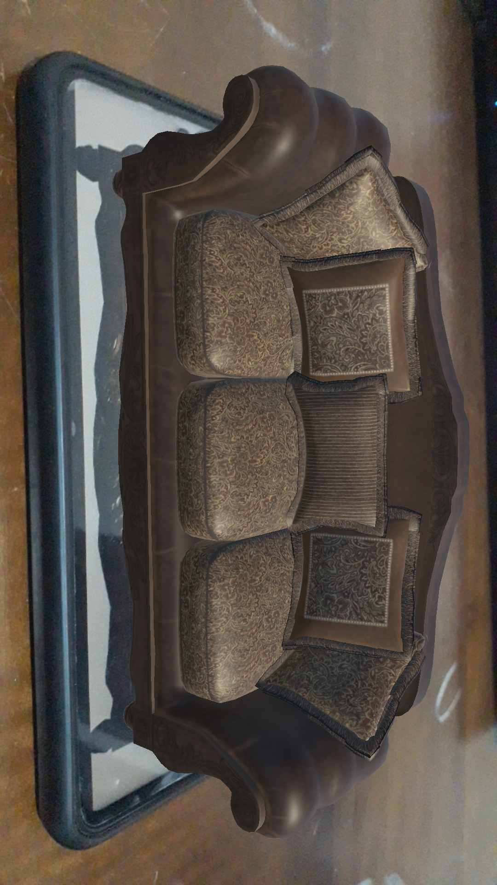
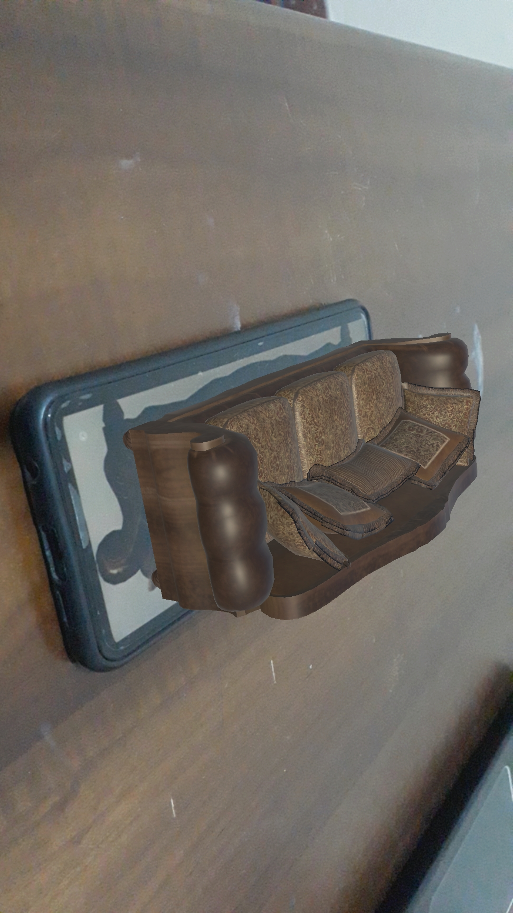
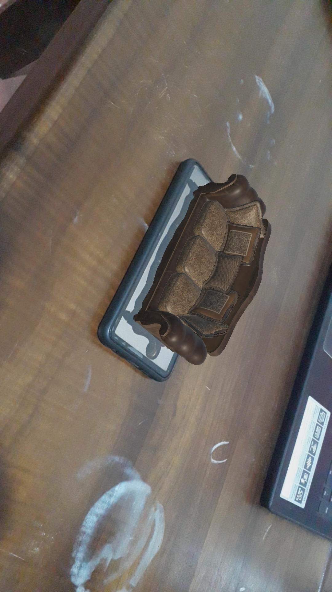
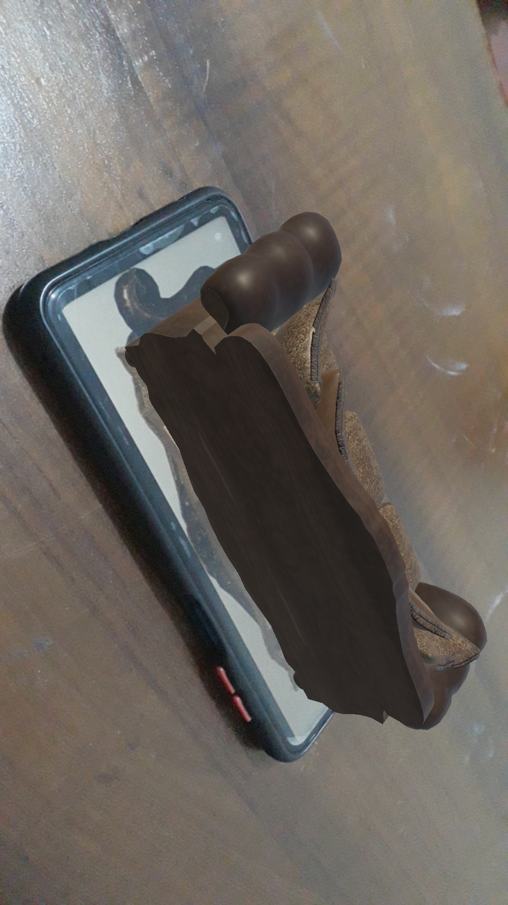

# Furniture Store Augmented Reality Application
 
 
 
Simple augmented reality application made with unity and vuforia library.
## Screen Shots
 
 
 
 

 

## Installation
Open the project in unity and go to File>Build Settings.then build the project for android operating system and save the apk file.install the apk file in your phone.
give the necessary permissions as asked to install 3rd party application.
Open the installed application then scan the provided target image(/ReadMe/TargetImage.jpeg) to see the results.

## Used Technologies
✔️ Vuforia Library 
✔️ C# 

## Used Tools
✔️ Unity 
✔️ Visual Studio Community Edition 
